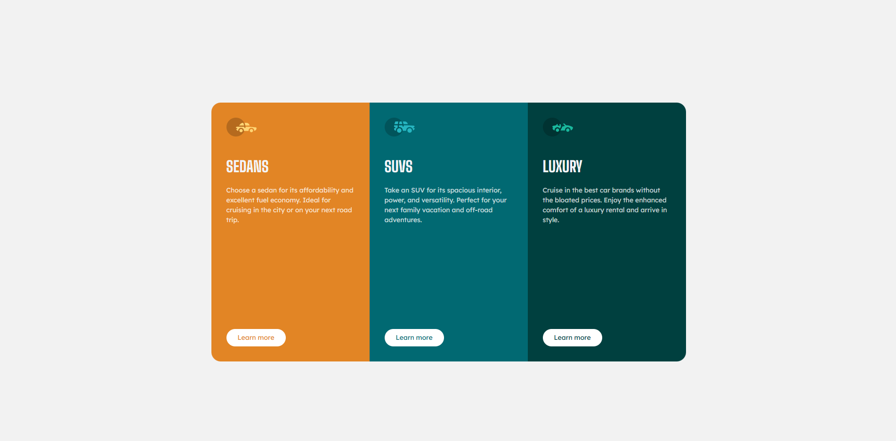

# 3-column preview card component

## A responsive three-column preview card with a structured layout.

The component presents content across three columns with a clear visual hierarchy, adapting smoothly to different screen sizes while emphasizing layout structure, responsiveness, and reusable UI composition.

### Screenshots

#### Image of the Desktop Design

#### Image of the Mobile Design

### Built with

- [React](https://react.dev/) - JS library
- [TypeScript](https://www.typescriptlang.org/) - type superset of JS
- [Tailwindcss](https://tailwindcss.com/) - utility-first CSS framework

## Author

- Website - [Mihailo Djurovic](portfolio-miahilo.vercel.app)
